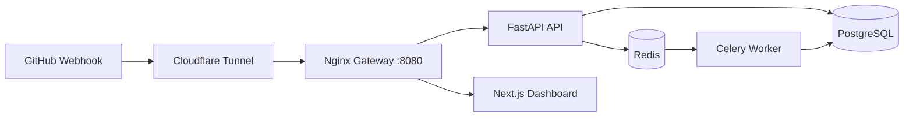

# RelayOps

> A self-hosted GitHub webhook monitor and controlled deployment-automation platform.

RelayOps validates GitHub webhooks, stores every delivery, avoids duplicate processing, creates asynchronous deployment jobs, and provides a dashboard for payload inspection, logs, replay, and retry.


## Why this project matters

This project is designed as a portfolio piece for Backend / DevOps roles. It demonstrates operational concerns that are often absent from basic CRUD apps:

- HMAC SHA-256 validation of GitHub webhook deliveries.
- Idempotency using GitHub's delivery ID and a unique PostgreSQL constraint.
- Redis-backed rate limiting to protect the webhook ingress.
- PostgreSQL persistence and Alembic migrations.
- Redis + Celery background workers to acknowledge webhooks quickly.
- Safe deployment execution: webhook payload is **never** passed to a shell command.
- Retry with exponential backoff, job logs, manual retry, and event replay.
- Nginx reverse proxy and a Next.js dashboard.
- GitHub Actions for tests and an optional manual SSH deployment workflow.

## Architecture



## Feature checklist

- [x] Receive GitHub `push` webhook.
- [x] Verify `X-Hub-Signature-256` from the **raw** payload.
- [x] Reject duplicate `X-GitHub-Delivery` values.
- [x] Persist event metadata and payload in PostgreSQL.
- [x] Limit webhook ingress per source IP with Redis.
- [x] Queue a deployment job for every `push` event.
- [x] Process the job separately in a Celery worker.
- [x] Retry transient failures with exponential backoff.
- [x] View webhook payloads and job logs in the dashboard.
- [x] Replay a previous push event and retry failed jobs.
- [x] Run everything with one Docker Compose command.

## Stack

| Layer | Technology |
|---|---|
| Gateway | Nginx |
| API | FastAPI + SQLAlchemy |
| Database | PostgreSQL 16 |
| Queue / cache | Redis 7 |
| Worker | Celery |
| Dashboard | Next.js |
| Containers | Docker Compose |
| CI/CD | GitHub Actions |

## Run locally

### Prerequisites

- Docker Desktop running.
- Git.
- A GitHub repository where you can add a webhook.
- `cloudflared` only for receiving GitHub deliveries on your local machine.

### 1. Configure secrets

```bash
cp .env.example .env
./scripts/generate_secret.sh
```

Open `.env`, replace `GITHUB_WEBHOOK_SECRET` with the generated value, and change the PostgreSQL password. Keep `.env` private.

### 2. Start the full stack

```bash
docker compose up --build
```

Open these URLs:

- Dashboard: `http://localhost:8080`
- API health: `http://localhost:8080/health`
- API docs: `http://localhost:8080/docs`

### 3. Run a local signed webhook test

Open a second terminal in the project root:

```bash
./scripts/test_webhook.sh
```

Then open the dashboard. You should see a `push` event and a `success` deployment job.

### 4. Connect GitHub using Cloudflare Tunnel

Keep Docker running. In a second terminal:

```bash
cloudflared tunnel --url http://localhost:8080
```

Copy the `https://...trycloudflare.com` URL. In the target GitHub repository, open:

```text
Settings → Webhooks → Add webhook
```

Set:

```text
Payload URL: https://YOUR-URL.trycloudflare.com/webhooks/github
Content type: application/json
Secret: exact value of GITHUB_WEBHOOK_SECRET in .env
Events: Just the push event
Active: enabled
```

Push a commit. GitHub should show a successful delivery; the RelayOps dashboard should show both the event and its deployment job.

## Important environment variables

| Variable | What it does |
|---|---|
| `GITHUB_WEBHOOK_SECRET` | Required HMAC secret shared with GitHub. |
| `DASHBOARD_API_TOKEN` | Optional token for `/events` and `/jobs`; set it before exposing the dashboard. |
| `ALLOWED_REPOSITORY` | Restricts worker execution to `owner/repository`. |
| `ALLOWED_BRANCH` | Optional: restricts worker execution to one branch, for example `main`. |
| `DEPLOY_MODE` | `simulate` for demo or `command` for an operator-approved command. |
| `DEPLOY_COMMAND` | Command executed only when `DEPLOY_MODE=command`; never includes webhook payload. |

## Deploy mode

The default `DEPLOY_MODE=simulate` is intentionally safe and makes the project easy to demo.

For a controlled deployment command, use:

```env
DEPLOY_MODE=command
DEPLOY_COMMAND=/usr/local/bin/deploy-relayops
ALLOWED_REPOSITORY=YOUR_GITHUB_USERNAME/relayops
ALLOWED_BRANCH=main
```

Create `/usr/local/bin/deploy-relayops` on a trusted server and protect it with filesystem permissions. Do **not** let webhook payload values build shell commands. Before production use, also set `DASHBOARD_API_TOKEN`, use a named Cloudflare Tunnel with authentication, and restrict the exposed routes.

## Useful commands

```bash
# Start or rebuild
docker compose up --build

# Status
docker compose ps

# Follow logs
docker compose logs -f --tail=150

# Worker logs only
docker compose logs -f worker

# Run backend tests in Docker
docker compose run --rm api pytest -q

# Stop

docker compose down

# Reset ALL local data (destructive)
docker compose down -v
```

## CI/CD

- `.github/workflows/ci.yml` runs backend unit tests and validates Compose on pushes and pull requests.
- `.github/workflows/deploy.yml` is a **manual** SSH deploy workflow. Add these GitHub Actions secrets before using it:

```text
DEPLOY_HOST
DEPLOY_SSH_PORT
DEPLOY_USER
DEPLOY_PATH
DEPLOY_SSH_PRIVATE_KEY
```

## Suggested commit history

```text
feat: add HMAC-validated GitHub webhook receiver
feat: persist webhook deliveries with idempotency protection
feat: add Redis-backed Celery deployment worker
feat: add dashboard with event replay and job retry
ops: add Nginx gateway and Docker Compose stack
ci: add automated backend tests and deployment workflow
```

## Security notes

RelayOps is a learning and portfolio project. A public production deployment needs further hardening: managed secrets, authentication/authorization, TLS, audit logging, resource quotas, monitoring, backups, ingress restrictions, and a carefully isolated deployment runner.
GitHub integration test
